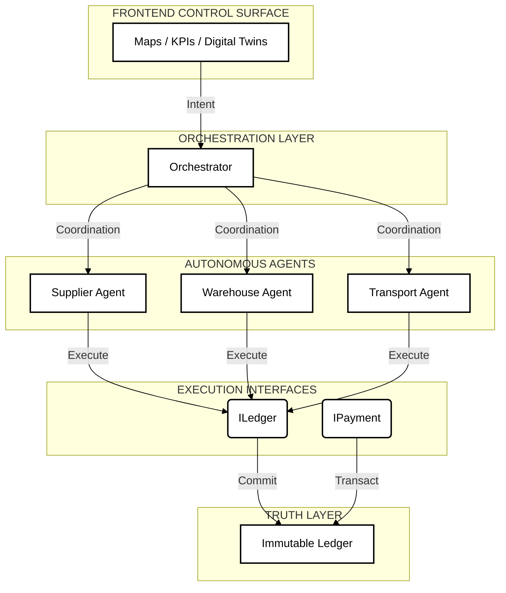

# LEDGERA | Decentralized Supply Chain OS


**Trust is Good. Verification is Better.**

Ledgera is a deterministic state machine for global trade execution. It replaces opaque logistics with a transparent, cryptographically verifiable operating system. By synchronizing physical movement with digital settlement in real-time, it eliminates disputes and accelerates capital turnover.

## 🚀 Features

### Public Brand (`/`)
- **Cinematic Experience**: Scroll-linked storytelling with Framer Motion.
- **Light Theme**: Clean, professional aesthetic for public-facing trust.
- **Architecture Visualization**: Interactive SVG topology diagrams.

### Control Room (`/dashboard`)
- **Command Interface**: Dark-mode, high-contrast aesthetic designed for long-session monitoring.
- **Live Geo-Spatial Tracking**: Real-time asset visualization using MapLibre GL.
- **Agent Decision Feed**: distinct log of automated system actions (Escrow release, Risk flag, etc.).
- **Trust Scores**: Dynamic entity reputation visualization.

### Security Core
- **Zero Trust Architecture**: Every interaction is signed and verifiable.
- **Non-Custodial Escrow**: Smart contracts hold funds, released only upon cryptographic proof of delivery.
- **Identity (DID)**: Portable reputation attached to decentralized identifiers.

## 🛠️ Tech Stack

- **Frontend**: Next.js 15 (App Router), React 19, Tailwind CSS v4.
- **Animation**: Framer Motion, CSS Native Scroll-Linked Effects.
- **Mapping**: MapLibre GL JS.
- **Backend (In-Progress)**: Supabase (PostgreSQL + Realtime), Prisma ORM.

## 📦 Installation

1.  **Clone the repository**
    ```bash
    git clone https://github.com/Ramrajnagar/Decentralized-Supply-Chain-Orchestrator.git
    cd Decentralized-Supply-Chain-Orchestrator
    ```

2.  **Install Dependencies**
    ```bash
    npm install
    ```

3.  **Environment Setup**
    Copy `.env.local.example` to `.env.local` and add your Supabase credentials.
    ```bash
    cp .env.local.example .env.local
    ```

4.  **Run Development Server**
    ```bash
    npm run dev
    ```

5.  **Build for Production**
    ```bash
    npm run build
    npm start
    ```

## 🏗️ Architecture

The system follows a hybrid architecture:
1.  **Edge Gateway**: IoT sensors push telemetry via MQTT/WebSockets.
2.  **Supabase Realtime**: Normalizes data and broadcasts state changes.
3.  **Agent Engine**: Subscribes to streams and executes deterministic logic (e.g., "If Temp > 4C, Trigger Claim").
4.  **Blockchain Anchor**: Hashes critical events to a public ledger for auditability.

## 1. System Overview

**LEDGERA** is an operating system for autonomous supply chains. Unlike traditional ERPs that simply *record* data, LEDGERA uses autonomous agents to *negotiate, execute, and settle* trade logistics on an immutable ledger.

**Core Philosophy**: "Code is Law. Agents are Executors."

### Key Capabilities
*   **Autonomous Orchestration**: Multi-agent swarms (Supplier, Warehouse, Transport) negotiate logistics without human intervention.
*   **Immutable Audit Trail**: Every state change (Order -> Shipped -> Delivered) is cryptographically committed.
*   **Deterministic Execution**: Smart contracts ensure funds are only released upon verified delivery.
*   **Privacy-First**: Designed for Zero-Knowledge (ZK) compliance (Enterprise version).

---

## 2. Architecture

LEDGERA follows a strict hierarchical control flow, separating Intent (Frontend) from Truth (Ledger).



---

## 3. Mission Enterprise Roadmap

We are currently in **Phase 1 (Foundation)**. Our  roadmap aims to evolve LEDGERA into a fully autonomous economy.

| Phase | Est. Timeline | Focus | Key Feature |
| :--- | :--- | :--- | :--- |
| **I** | **2025-present** | **Foundation** | Autonomous Swarms & Ledger Integration |
| **II** | WHO KNOWS | Privacy | Zero-Knowledge Proofs (ZK-Snarks) for Suppliers |
| **III** | COOMING SOON | Autonomy | Autonomous Negotiation Protocol (ANP) & DAO |


---

## 4. Developer Start

### Prerequisites
*   Node.js 18+
*   Supabase Account
*   Git

### System Boot

**1. Clone and Install**
```bash
git clone https://github.com/Ramrajnagar/Decentralized-Supply-Chain-Orchestrator.git
cd Decentralized-Supply-Chain-Orchestrator
npm install
```

**2. Configure Environment**
```bash
cp .env.local.example .env.local
# Edit .env.local with your Supabase credentials
```

**3. Launch Development Server**
```bash
npm run dev
```

### Access Points
*   **Landing Page**: `http://localhost:3000`
*   **Dashboard**: `http://localhost:3000/dashboard`
*   **Stories**: `http://localhost:3000/stories`

---

## 5. Directory Structure

```text
/src
    /app             # Next.js App Router Pages
    /components      # React Components
    /lib             # Utilities & Configurations
    /contexts        # React Context Providers
/public              # Static Assets
/prisma              # Database Schema
```

---

## 📜 License

MIT License. See [LICENSE](LICENSE) for details.

---

**Ledgera** — _Orchestrating the World's Trade._
