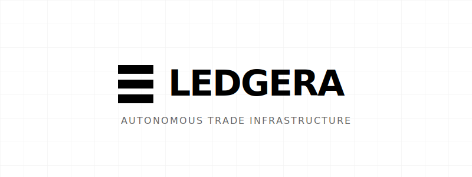
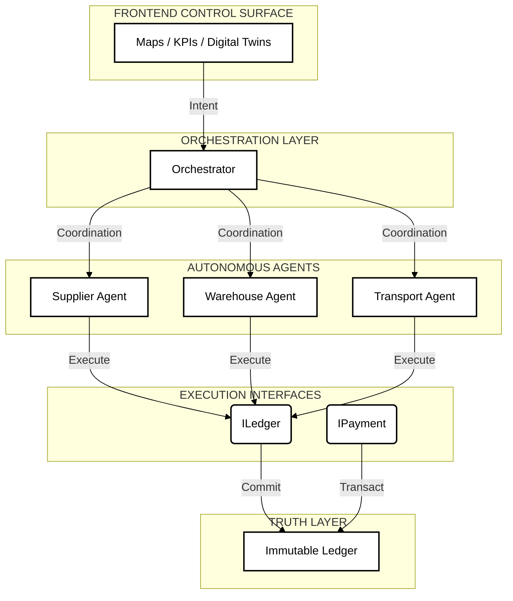

# LEDGERA
> **Autonomous Trade Infrastructure**

[](https://github.com/ledgera/core)
[](https://opensource.org/licenses/MIT)
[](https://www.python.org/)
[](https://ledgera.network)

---

## 1. System Overview

**LEDGERA** is an operating system for autonomous supply chains. Unlike traditional ERPs that simply *record* data, LEDGERA uses autonomous agents to *negotiate, execute, and settle* trade logistics on an immutable ledger.

**Core Philosophy**: "Code is Law. Agents are Executors."

### Key Capabilities
*   **Autonomous Orchestration**: Multi-agent swarms (Supplier, Warehouse, Transport) negotiate logistics without human intervention.
*   **Immutable Audit Trail**: Every state change (Order -> Shipped -> Delivered) is cryptographically committed.
*   **Deterministic Execution**: Smart contracts ensure funds are only released upon verified delivery.
*   **Privacy-First**: Designed for Zero-Knowledge (ZK) compliance (Roadmap 2032).

---

## 2. Architecture

LEDGERA follows a strict hierarchical control flow, separating Intent (Frontend) from Truth (Ledger).



---

## 3. Mission 2032 Roadmap

We are currently in **Phase 1 (Foundation)**. Our 6-year roadmap aims to evolve LEDGERA into a fully autonomous economy.

| Phase | Est. Timeline | Focus | Key Feature |
| :--- | :--- | :--- | :--- |
| **I** | **2025-2026** | **Foundation** | Autonomous Swarms & Ledger Integration |
| **II** | 2027-2028 | Privacy | Zero-Knowledge Proofs (ZK-Snarks) for Suppliers |
| **III** | 2029-2032 | Autonomy | Autonomous Negotiation Protocol (ANP) & DAO |

*For full details, see [project_blueprint_2032.md](project_blueprint_2032.md).*

---

## 4. Developer Start

### Prerequisites
*   Python 3.10+
*   Node.js 18+
*   OpenAI API Key (for Agent Swarm)

### System Boot

**1. Initialize Ledger & Orchestrator (Backend)**
```bash
cd backend
python -m venv venv
source venv/bin/activate  # Windows: venv\Scripts\activate
pip install -r requirements.txt
cp .env.example .env      # Add keys
python main.py
```

**2. Launch Control Surface (Frontend)**
```bash
cd NewFrontend/DISCO
npm install
npm run dev
```

### Access Points
*   **Control Surface**: `http://localhost:5173`
*   **API Gateway**: `http://localhost:8000/docs`
*   **Ledger Explorer**: `http://localhost:5173/analytics`

---

## 5. Directory Structure

```text
/backend
    /agents          # CrewAI Agent Definitions (Logic)
    /blockchain      # Ledger Implementation (Truth)
    /workflow        # Swarm Orchestration (Coordination)
    /analytics       # Trust Scoring & Metrics

/NewFrontend/DISCO
    /src/components  # React UI Components
    /src/services    # API Interfaces
```

---

> **License**: MIT  
> **Maintainer**: LEDGERA Core Team
